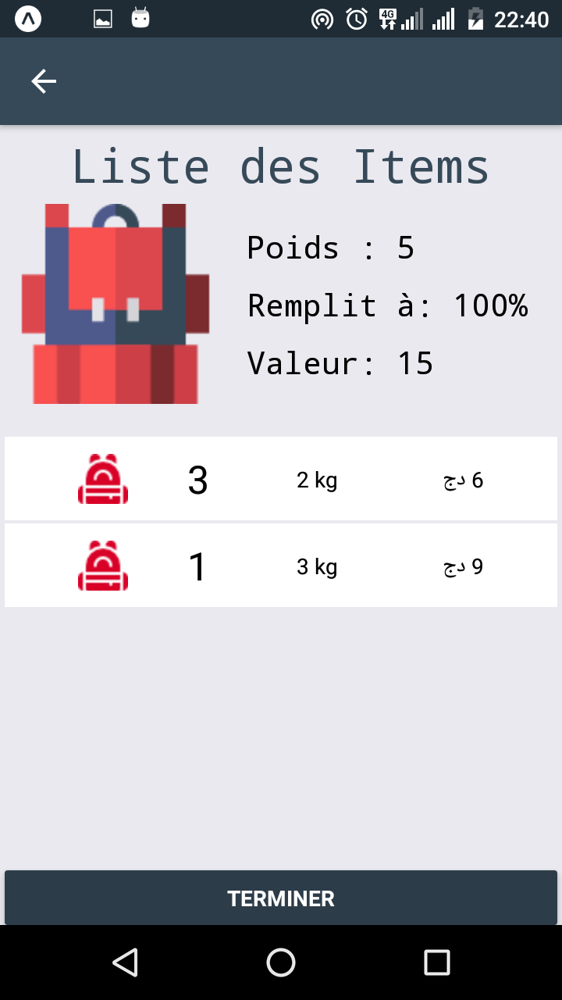

# Knapsack
A mobile application made in react native that explain the well-known combinatorial optimization problem : Knapsack problem.

In this interactive app, you can test different values and understand how dynamic programming helps solve difficult problem in few seconds.

